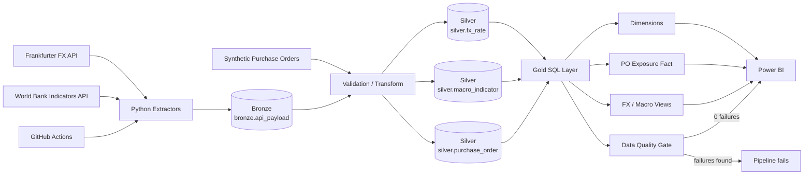
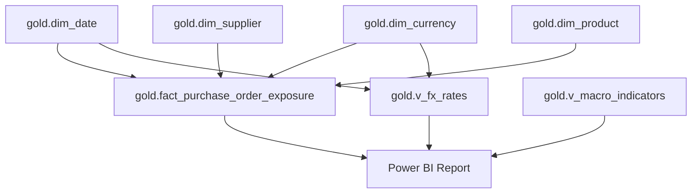

# Architecture

## End-to-end data flow

## Layer responsibilities

| Layer | Responsibility |
|---|---|
| Extract | Call public APIs with retry/error handling and retain source payloads |
| Bronze | Preserve raw API responses for lineage, debugging and replay |
| Silver | Validate, type, deduplicate and standardise business-grain records |
| Gold | Expose reporting-ready dimensions, facts and analytical views |
| Power BI | Semantic model, DAX measures, reconciliation and decision-oriented reporting |
| GitHub Actions | Run tests and scheduled/manual ETL orchestration |

## Design choices

- **Bronze / Silver / Gold separation** keeps source lineage, transformation logic and reporting logic distinct.
- **PostgreSQL `ON CONFLICT` upserts** make reruns idempotent and safe for scheduled execution.
- **FX inversion is explicit**: source observations are converted to ZAR per unit of USD, GBP or EUR before reporting.
- **Synthetic purchase orders** provide the commercial scenario without using confidential employer data.
- **April-to-March fiscal attributes** are created upstream in `gold.dim_date`.
- **Gold SQL views** keep business rules upstream so Power Query remains intentionally light.
- **Data quality is a pipeline gate**: the ETL fails when `gold.v_data_quality_failures` returns any row.
- **GitHub Actions** runs automated tests before ETL execution. The repository secret `DATABASEURL` is exposed to Python as `DATABASE_URL`.

## Power BI semantic model

The macroeconomic view remains at annual grain and is intentionally not forced into the daily date dimension.

## Report pages

1. **Treasury Executive Overview** — exposure, variance and upcoming foreign-currency requirements.
2. **Currency Risk Analysis** — current rates, historical FX trend, budget comparison and 30-day movement.
3. **Procurement Exposure** — supplier, product and purchase-order concentration.
4. **Macro & Market Context** — South African inflation, GDP growth and annual/YTD FX context.
